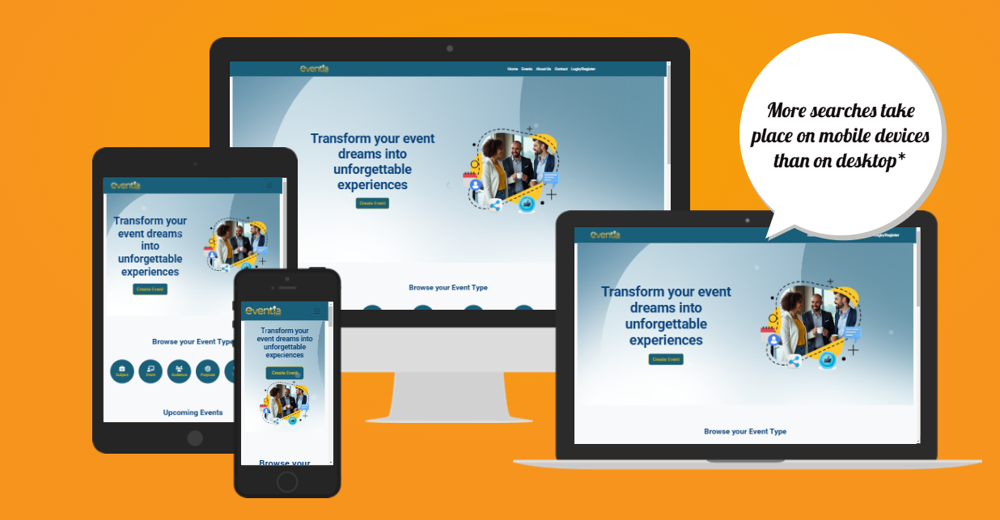

# Eventia

# Introduction
Eventia is a user-friendly event management application designed for anyone looking to create or explore events effortlessly. Developed as part of the Code Institute's Full-Stack Developer course, this project showcases proficiency in Django and Bootstrap frameworks, database management, and CRUD functionality. Eventia serves as a third milestone project in the course, built exclusively for educational purposes.

Experience the live site here: [Eventia](https://eventia-dfe1ce6afa74.herokuapp.com/)  