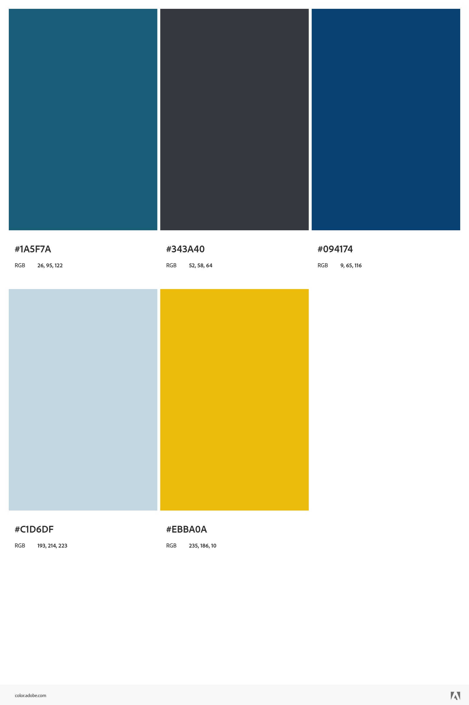
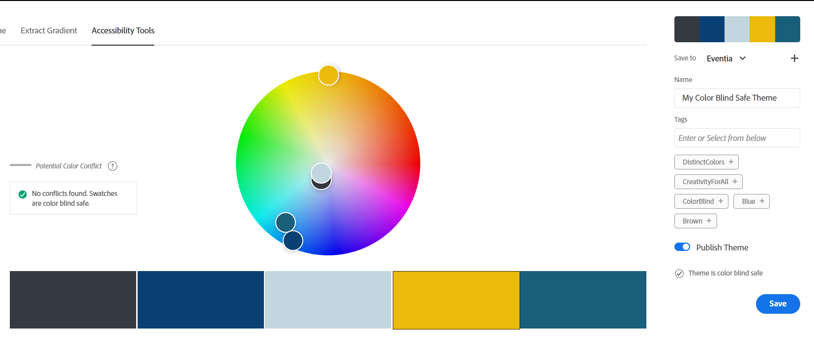
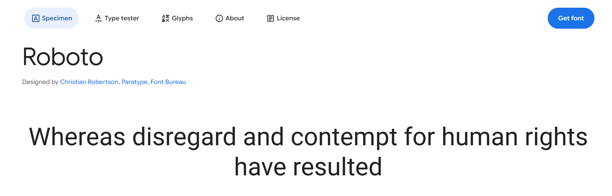
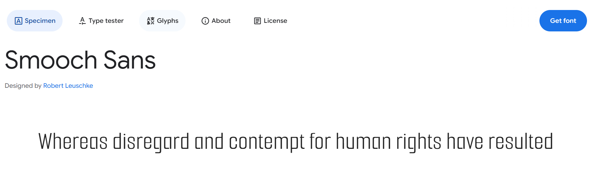
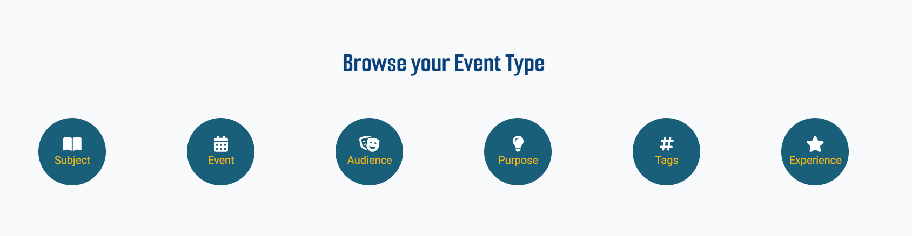
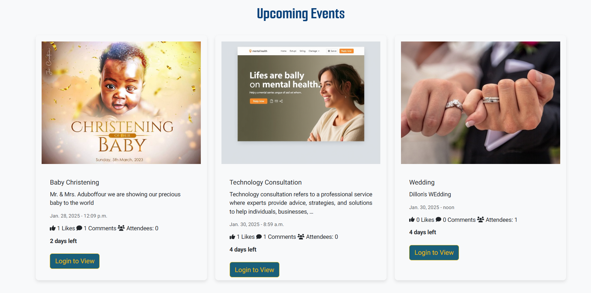
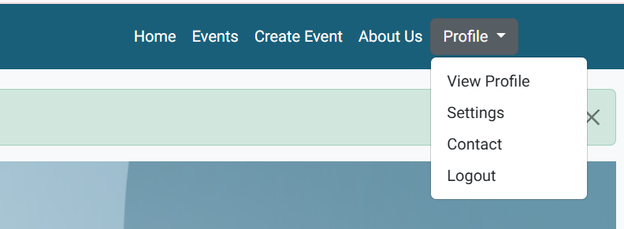
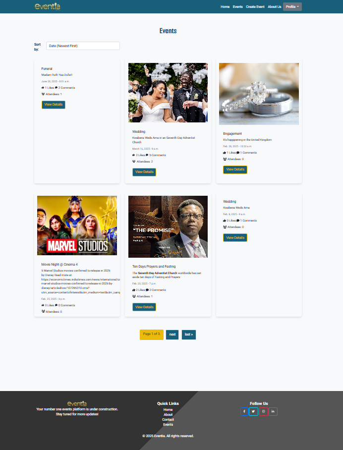
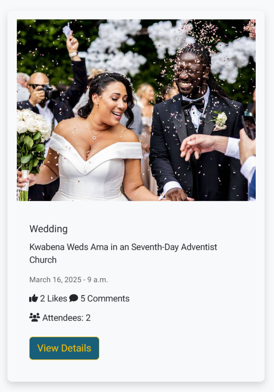
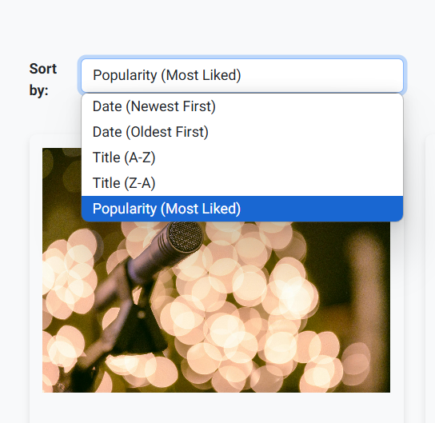

# Eventia


# Introduction
Eventia is a user-friendly event management application designed for anyone looking to create or explore events effortlessly. Developed as part of the Code Institute's Full-Stack Developer course, this project showcases proficiency in Django and Bootstrap frameworks, database management, and CRUD functionality. Eventia serves as a third milestone project in the course, built exclusively for educational purposes.

Experience the live site here: [Eventia](https://eventia-dfe1ce6afa74.herokuapp.com/)  

For Admin access with relevant sign-in information: [Eventia Admin](https://eventia-dfe1ce6afa74.herokuapp.com/admin/)

<hr>

## Table of Contents

- [Eventia](#eventia)
  - [Introduction](#introduction)
  - [Table of Contents](#table-of-contents)
  - [Overview](#overview)
- [UX - User Experience](#ux---user-experience)
  - [Design Inspiration](#design-inspiration)
    - [Colour Scheme](#colour-scheme)
    - [Font](#font)
- [Project Planning](#project-planning)
  - [Strategy Plane](#strategy-plane)
    - [Site Goals](#site-goals)
  - [Agile Methodologies - Project Management](#agile-methodologies---project-management)
    - [MoSCoW Prioritization](#moscow-prioritization)
    - [Sprints](#sprints)
  - [User Stories](#user-stories)
    - [Visitor User Stories](#visitor-user-stories)
    - [Epic - User Profile](#epic---user-profile)
    - [Epic - Articles](#epic---articles)
    - [Epic - Booking](#epic---booking)
    - [Epic - Photo Gallery](#epic---photo-gallery)
    - [Epic - Visit Us/Reviews](#epic---visit-usreviews)
  - [Scope Plane](#scope-plane)
  - [Structural Plane](#structural-plane)
  - [Skeleton \& Surface Planes](#skeleton--surface-planes)
    - [Wireframes](#wireframes)
    - [Database Schema - Entity Relationship Diagram](#database-schema---entity-relationship-diagram)
    - [Security](#security)
- [Features](#features)
  - [User View - Registered/Unregistered](#user-view---registeredunregistered)
  - [CRUD Functionality](#crud-functionality)
  - [Feature Showcase](#feature-showcase)
  - [Future Features](#future-features)
- [Technologies \& Languages Used](#technologies--languages-used)
  - [Libraries \& Frameworks](#libraries--frameworks)
  - [Tools \& Programs](#tools--programs)
- [Testing](#testing)
- [Deployment](#deployment)
  - [Connecting to GitHub](#connecting-to-github)
  - [Django Project Setup](#django-project-setup)
  - [Cloudinary API](#cloudinary-api)
  - [Elephant SQL](#elephant-sql)
  - [Heroku deployment](#heroku-deployment)
  - [Clone project](#clone-project)
  - [Fork Project](#fork-project)
- [Credits](#credits)
  - [Code](#code)
  - [Media](#media)
    - [Additional reading/tutorials/books/blogs](#additional-readingtutorialsbooksblogs)
  - [Acknowledgements](#acknowledgements)

## Overview 

Eventia is a dynamic event management platform designed to connect event organizers and attendees in a seamless, interactive environment. Users are invited to:

- Join the Eventia community
- Create personalized profiles with display pictures
- Customize their experience with password management and theme preferences
- Discover and engage with upcoming events
- Interact with events through likes and comments
- Track event countdowns
- Request attendance to events

Organize and manage events (for event creators)
Eventia is fully responsive and accessible across all modern web browsers, ensuring a smooth user experience on various devices. The platform aims to foster a vibrant community of event enthusiasts and organizers, facilitating meaningful interactions and efficient event management.
Key features of Eventia include:
- User authentication and profile customization
- Event discovery and interaction (liking, commenting, attendance requests)
- Event creation and management for organizers
- Real-time event countdowns
- Attendance approval system for organizers
- Engagement tracking (likes, comments, attendee counts)

Eventia addresses the growing need for a centralized, user-friendly event management solution. It simplifies the process of organizing and attending events, while building a community of like-minded individuals. Future developments may include integrated payment systems, advanced search and filtering options, and enhanced social networking features to further connect users with shared interests.

# UX - User Experience

## Design Inspiration


*Inspired by the Universal presence of microphones at various event & power of Gold color*

I drew inspiration from leading event management platforms like Cvent and Eventbrite when conceptualizing Eventia. These industry leaders, recommended by Perplexity AI, provided valuable insights into the essential features and user experience for a successful event management platform.

The name "Eventia" was chosen as a creative play on the word "Event," designed to be both memorable and indicative of the platform's purpose. It conveys a sense of excitement and professionalism, aligning perfectly with our mission to facilitate exceptional event experiences.

Collaborating with talented graphic designer Mr. Adofo Beckson, we developed a distinctive and meaningful logo for Eventia. The logo cleverly incorporates a microphone in place of the letter 'i', symbolizing the universal presence of microphones at various events. This design element not only adds visual interest but also reinforces the platform's connection to live events and public gatherings.

We chose a luxurious pure gold color scheme for the logo and key design elements. This color choice represents excellence, prestige, and the high-quality experience we aim to provide through Eventia. The golden hue also evokes a sense of celebration and success, which aligns well with the spirit of events hosted on our platform.

Eventia aims to combine the best features of established platforms with innovative solutions, creating a user-friendly, comprehensive event management experience for both organizers and attendees.

### Colour Scheme

For Eventia, we carefully selected a color palette that embodies professionalism, trust, and excitement. Our chosen colors are:
- Deep Blue ```#094174``` : Represents trust and professionalism 
- Teal ```#1A5F7A``` : Evokes a sense of balance and stability
- Gold ```#EBBA0A```: Symbolizes celebration and success
- Light Blue ```#C1D6DF```: Provides a calming contrast
This color scheme creates a harmonious blend that reflects Eventia's commitment to delivering exceptional event experiences. The deep blue and teal colors convey reliability and sophistication, while the gold accent adds a touch of luxury and celebration. The light blue offers a refreshing contrast, enhancing readability and user experience.
Importantly, our color palette has passed the Color Blind Safe check on [Adobe Color](https://color.adobe.com/), ensuring that Eventia's design is accessible to users with various forms of color vision deficiency. This commitment to accessibility aligns with our goal of creating an inclusive platform for all event organizers and attendees.


*Colour Scheme pallete for Eventia website*


*Accessibility checks for Eventia website colour scheme*

### Font
For Eventia, two complementary [Google Fonts](https://fonts.google.com/) was carefully selected to enhance the user experience and reflect the platform's professional yet approachable nature:

#### Roboto Slab Designed by Christian Robertson for Google
*Main Body Font*
- Chosen for its excellent readability and modern slab-serif style
- Conveys a sense of reliability and professionalism, aligning with Eventia's commitment to delivering high-quality event management services.



#### Smooch Sans Created by Fontsmiths and Sabrina Mariela Lopez
*Heading Font*
- Selected for its playful yet elegant sans-serif design
- Adds a touch of creativity and excitement, mirroring the diverse range of events hosted on Eventia



The combination of Roboto Slab's sturdy structure and Smooch Sans' dynamic character creates a perfect balance between professionalism and creativity. This pairing reflects Eventia's dual focus on providing a reliable platform for event organizers while celebrating the unique and exciting nature of each event.

# Project Planning  

The goal of Eventia was to create a comprehensive event management platform that simplifies the process of organizing and attending events. The 'product' is a user-friendly interface for event creation, management, and attendance, while the 'users' are event organizers, attendees, and enthusiasts.

The aim was to develop an intuitive system that streamlines event planning and participation. Through careful planning and design, an opportunity was recognized to transform Eventia into more than just a booking platform – it became a vibrant community for event lovers.

A social element naturally evolved, allowing users to share experiences, like events, and engage in discussions through comments. This fosters a dynamic community of event-goers who can recommend events to others, share exciting upcoming gatherings, and attract more users to join the platform.

Following modern design trends, an elegant color scheme was incorporated, featuring deep blue, teal, and gold, complemented by intuitive icons and high-quality imagery. The result is an attractive, user-centric platform that not only facilitates event management but also creates a thriving ecosystem for event enthusiasts.
 
## Strategy Plane
- Create a user-friendly platform for event organizers and attendees.
- Utilize a professional color scheme of deep blue, teal, and gold to identify connected features, with ample white space for clarity and focus.
- Implement recognizable icons with custom designs to fit the event management theme.
- Provide an intuitive UI for efficient CRUD functionalities related to events and user interactions.
- Ensure consistent UX across mobile, tablet, and desktop devices.
- Develop a scalable platform to accommodate future features and business growth.

The goals for Eventia focus on creating a professional, easy-to-use event management system that caters to both organizers and attendees. The color scheme and design elements are chosen to convey trust and excitement, while the user interface is designed for efficiency across all devices. The platform's scalability allows for future enhancements to meet evolving user needs and expand the business.

## Agile Methodologies - Project Management
Eventia marks my third experience with Agile planning methods, and I've found that my proficiency and comfort with this approach have significantly improved. As someone who values thorough preparation and planning, I've come to appreciate the flexibility and efficiency that Agile methodologies offer.

For this project, I utilized the [Github Projects Board](https://github.com/users/Kaakyire9/projects/9/views/1) to plan and document all aspects of my work. This tool has proven invaluable in organizing tasks, tracking progress, and maintaining a clear overview of the project's development.

With each iteration of using Agile methodologies, I've refined my process and gained deeper insights into effective project management. This third experience has allowed me to implement lessons learned from previous projects, resulting in a more streamlined and efficient development process for Eventia.

The Github Projects Board has been instrumental in breaking down the project into manageable tasks, prioritizing features, and maintaining a steady workflow. It has also facilitated better collaboration and transparency throughout the development process.

As I continue to embrace Agile methodologies, I look forward to further enhancing my project management skills and delivering even more successful outcomes in future endeavors.

### MoSCoW Prioritization

I chose to follow the MoSCoW Prioritization method for Eventia, identifying and labelling my:

- **Must Haves**: the 'required', critical components of the project. Completing my 'Must Haves' helped me to reach the MVP (Minimum Viable Product) for this project early, allowing me to develop the project further than originally planned.
  
- **Should Haves**: the components that are valuable to the project but not absolutely 'vital' at the MVP stage. The 'Must Haves' must receive priority over the 'Should Haves'.
- **Could Haves**: these are the features that are a 'bonus' to the project, it would be nice to have them in this phase, but only if the most important issues have been completed first and time allows.
- **Won't Haves**: the features or components that either no longer fit the project's brief or are of very low priority for this release. 

### Sprints

I divided the available time before project submission into sprints, aiming to complete the MVP for Eventia by January 22, 2025. This timeline was set considering the project's complexity and my goal to have the core functionalities implemented well before the final submission date of January 28, 2025.

As this is my first project using database schemas and Django, I anticipated potential challenges and allocated extra time for troubleshooting and learning. The project commenced on January 9, 2025, at 8 AM, giving me approximately three weeks to develop, test, and refine the platform.

I organized my work into three main categories:
- Dev (Developer) Tasks
- User Stories
- Testing Tasks

These were converted into issues and fully labeled on my Github Projects Board. Adding comments to issues proved invaluable, allowing me to quickly record information, sources, and fixes for later reference in my README.

My sprints represent general timeframes of focus on specific areas. Given the nature of balancing project work with other commitments, some sprint timeframes overlapped as I worked on the project during every available moment.

Despite being my first experience with Django and database schemas, I've made significant progress. The learning curve has been steep, but rewarding. I've encountered and overcome various challenges, particularly in setting up the database and implementing complex features like the event management system.

As of today, January 22, 2025, I'm pleased to report that the project is on track. The core functionalities are in place, and I'm now focusing on refining the user interface and conducting thorough testing. This leaves me with a comfortable buffer before the final submission date to address any unforeseen issues and potentially add extra features if time permits.
This sprint-based approach has not only helped me manage the project effectively but has also deepened my understanding of Agile methodologies in practice.

|Sprint No.|	Sprint Content|	Start/Finish Dates|
|----------|----------------|-------------------|
| #1 |	Project Setup and Basic Models|	Jan 9, 2025 - Jan 12, 2025|
| #2 |	User Authentication and Profiles|	Jan 13, 2025 - Jan 15, 2025|
| #3 |	Event Creation and Management|	Jan 16, 2025 - Jan 18, 2025|
|#4|	Event Detail Page and Interactions|	Jan 19, 2025 - Jan 21, 2025|
|#5|	Comments and Likes Functionality|	Jan 22, 2025 - Jan 24, 2025|
|#6|	Attendance Request and Approval System|	Jan 25, 2025 - Jan 26, 2025|
|#7|	Final Testing and Bug Fixes|	Jan 27, 2025 - Jan 28, 2025|

## User Stories

User stories and features recorded and managed on [GitHub Projects](<https://github.com/users/Kaakyire9/projects/9>)

### Visitor User Stories
| User Story | Priority |
|------------------------------------------------------------------------------------------------------------------------|---------------|
|As a **user**, I want to **view a paginated list of upcoming events**  so I can **decide which to attend**  | **MUST HAVE** |
|As a **user**, I want a **visually appealing, responsive event page** that **works on all devices**| **SHOULD HAVE** |
|As a **user**, I want a **navigation bar** so I can **easily access key features of the application** | **SHOULD HAVE** |

### Epic - User Profile
| User Story | Priority |
|------------------------------------------------------------------------------------------------------------------------|---------------|
|As a **user**, I want to **create an account and log in securely** so I can **manage my events and RSVPs** | **MUST HAVE** |
|As a **registered user**,  I want to **update my profile information** So that I can **keep my details up to date** | **SHOULD HAVE** |
|As a **user**, I want to **receive notifications about relevant changes to events I'm interested in**, so that I can **stay informed and up-to-date** | **COULD HAVE** |
|As an **organizer**, I want to **restrict unauthorized access** so that **only valid users can manage events** | **MUST HAVE** |

### Epic - Events
| User Story | Priority |
|------------------------------------------------------------------------------------------------------------------------|---------------|
|As an **organizer**, I want to **create an event with essential details (title, description, date, time, location, image/video)** so that I can **share it with attendees** | **MUST HAVE** |
|As an **authenticated user**, I want to c**reate and manage events** so that I can **organize gatherings for others to attend** | **MUST HAVE** |
|As an **attendee**, I want to **RSVP to an event** so that the  **organizer  will know I'm attending** | **MUST HAVE** |
|As an **event organizer**, I want to **edit event details** so I can **manage event information as needed** | **MUST HAVE** |
|As a **user**, I want to **be able to leave comments on events I'm interested in or attending**, so that I can **engage with other attendees and the event organizer** | **COULD  HAVE** |
|As an **organizer**, I want to **view and manage my guest list** so I can **track attendees** | **SHOULD HAVE** |
|As a **user**, I want to **perform CRUD operations on events (for organizers) and RSVPs (for attendees)** | **MUST HAVE** | 
|As a **user **I want to **share events on social media** So that I can **invite others to join** | **COULD HAVE** |
|As a **user** I want to **see a countdown to event start** So that I can **keep track of upcoming events** | **SHOULD HAVE** |

### Epic - Development and Infrastructure
| User Story | Priority |
|------------------------------------------------------------------------------------------------------------------------|---------------|
|As a **developer**, I want to **implement a custom data model for events and users** so that it will **fit the project requirements** | **MUST HAVE** |
|As a **user**, I want to **perform CRUD operations on events (for organizers) and RSVPs (for attendees)** | **MUST HAVE** | 
|As a **developer**, I want to **implement form validation for event creation and editing** to ensure **data integrity** | **MUST HAVE** |
|As a **developer**, I want to **write basic unit tests for event creation and RSVP functionality** to ensure **code reliability** | **SHOULD HAVE** |
|As a **developer**, I want to **deploy the project to a cloud service and document the process** for easy **setup and use..** | **MUST HAVE** |


## Scope Plane

As a Full Stack Individual Capstone Project at Code Institute, Eventia is designed to be both a learning experience and a functional event management platform. The project utilizes technologies such as Django, SQL, Bootstrap, and potentially Cloudinary for image handling. To maintain control over the project's scope and ensure the delivery of a Minimum Viable Product (MVP), features were carefully prioritized and organized into manageable blocks.

Following Agile Planning Methodologies, User Stories and Developer Tasks were added as issues on the GitHub project board, with Sprints set up to maintain project flow and progress tracking.

Essential features of Eventia include:

- A visually appealing, accessible website that meets user needs
- Responsive design for mobile, tablet, and desktop devices
- User Authentication and Registration
- Event Creation and Management with full CRUD functionality
- RSVP system for event attendance
- User Profile creation and editing
- Event listing and detail pages
- Basic search and filter functionality for events

The project's scope was carefully planned to balance the essential features required for MVP completion, satisfaction of assessment criteria, and the feasibility of implementation within the given timeframe. This approach allows for a focused development process while leaving room for potential future enhancements.


## Structural Plane

Eventia is a comprehensive event management platform designed to connect organizers and attendees. The structural plan for Eventia encompasses several key components that work together to provide a seamless user experience. At its core, the platform features user authentication, event creation and management, RSVP functionality, and social interaction features. The structure is built around a responsive design that ensures accessibility across various devices, from desktops to mobile phones. Key pages include a dynamic home page, an events listing page with search and filter capabilities, detailed event pages, user profiles, and administrative interfaces for event organizers. This carefully planned structure allows for intuitive navigation and efficient event management, catering to the needs of both event creators and attendees.


*Hero section with a call-to-action for Eventia*

The hero section of Eventia's home page features a striking visual backdrop that immediately captures the visitor's attention. It includes a bold headline that encapsulates the essence of the platform, such as "Connect, Create, Celebrate with Eventia." The call-to-action button prominently displayed invites users to "Explore Events" or "Create an Event," encouraging immediate engagement with the platform's core functionality.


*Event Type Category Section for Eventia*

The event type categories section provides users with a visual and intuitive way to browse events based on their interests. Each category is represented by an icon and label, such as "Open Book," "Calender," "Theater Masks," or "Star." This categorization helps users quickly find events that align with their preferences, enhancing the user experience and encouraging exploration of the platform's diverse offerings


*Upcoming Events Section for Eventia*

Below the Event Type Category, Eventia showcases a curated selection of upcoming events. This section highlights diverse event types to appeal to a wide audience. Each featured event is presented in an attractive card format, displaying key information such as the event title, date, time, the countdown days and a captivating image. This section serves to give visitors a quick overview of the exciting events available on the platform.


*Eventia Logo on the left side of the Navigation bar*

The Eventia logo, prominently displayed in the top-left corner of the navigation bar, serves as a visual anchor for the brand. It's designed to be memorable and reflective of the platform's purpose, featuring a stylized representation of connection or celebration. The logo acts as a home button, allowing users to return to the main page from anywhere on the site.


*Eventia Navbar Links for Unauthenticated Users*

The navigation bar provides easy access to key sections of the platform. The "Home" link returns users to the landing page, while "Events" directs them to a comprehensive list of upcoming gatherings. The "About Us" link visitors to a page that tell them what Eventia is about (its mission, vision, and values). The "Contact" Enables users to reach out for help, feedback, or inquiries about services. "Login/Register" options are clearly visible for new and returning users, ensuring quick access to personalized features.



*Eventia Navbar Links for Authenticated User*

Once authenticated, users see their profile information in a dropdown menu, typically represented by their username or a profile icon. This dropdown provides quick access to personal settings, created events, and logout functionality, enhancing user experience by centralizing account-related actions in one convenient location. "Create Event" is a call-to-action for organizers, leading to the event creation form.



*List of Upcoming events with pagination for Eventia* 

Eventia's events page showcases a comprehensive list of upcoming events, organized chronologically. The pagination feature ensures smooth navigation through numerous events, displaying a manageable number per page. This approach prevents overwhelming users with too much information at once and improves page load times.



*Event cards showing title, date, time, comments, likes and Attendees*

Each event is presented in an attractive card format, providing essential information at a glance. The cards display the event title, date, time, comments, likes and attendees allowing users to quickly assess their interest and availability. This concise presentation helps users efficiently browse through multiple events.



*Sort By Functionality on Eventia*

To enhance user experience, Eventia incorporates robust sort by. Users can easily find events that match their interests or specific criteria. The "Sort by" feature on a Eventia allows users to rearrange or organize a list of event based on specific criteria This feature significantly improves the discoverability of events and helps users find relevant gatherings more efficiently.


## Citations:
[1] https://ppl-ai-file-upload.s3.amazonaws.com/web/direct-files/40879804/91578d7d-dc67-46c1-9847-33ee283695c6/paste.txt

[2] https://www.cvent.com/uk

[3] https://www.eventbrite.co.uk

[4] https://color.adobe.com/

[5] https://fonts.google.com/specimen/Smooch+Sans

[6] https://github.com/users/Kaakyire9/projects/9/views/1