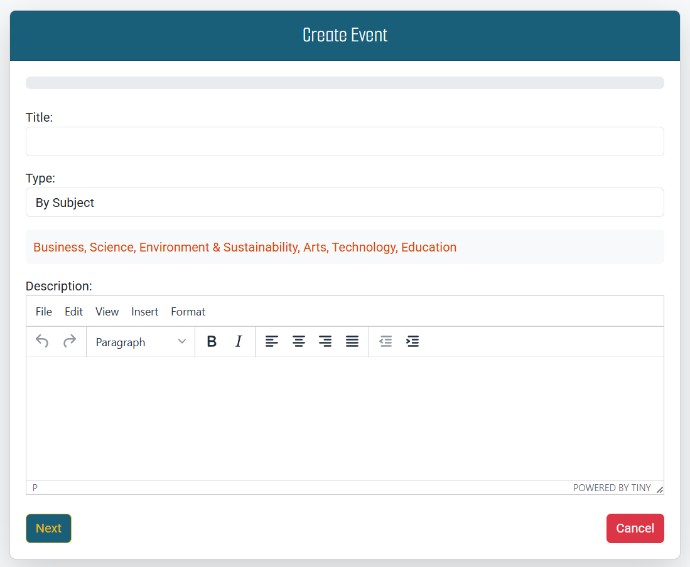

# Eventia


# Introduction
Eventia is a user-friendly event management application designed for anyone looking to create or explore events effortlessly. Developed as part of the Code Institute's Full-Stack Developer course, this project showcases proficiency in Django and Bootstrap frameworks, database management, and CRUD functionality. Eventia serves as a third milestone project in the course, built exclusively for educational purposes.

Experience the live site here: [Eventia](https://eventia-dfe1ce6afa74.herokuapp.com/)  

For Admin access with relevant sign-in information: [Eventia Admin](https://eventia-dfe1ce6afa74.herokuapp.com/admin/)

<hr>

## Table of Contents

- [Eventia](#eventia)
  - [Introduction](#introduction)
  - [Table of Contents](#table-of-contents)
  - [Overview](#overview)
- [UX - User Experience](#ux---user-experience)
  - [Design Inspiration](#design-inspiration)
    - [Colour Scheme](#colour-scheme)
    - [Font](#font)
- [Project Planning](#project-planning)
  - [Strategy Plane](#strategy-plane)
    - [Site Goals](#site-goals)
  - [Agile Methodologies - Project Management](#agile-methodologies---project-management)
    - [MoSCoW Prioritization](#moscow-prioritization)
    - [Sprints](#sprints)
  - [User Stories](#user-stories)
    - [Visitor User Stories](#visitor-user-stories)
    - [Epic - User Profile](#epic---user-profile)
    - [Epic - Events](#epic---events)
    - [Epic - Development and Infrastructure](#epic---booking)
  - [Scope Plane](#scope-plane)
  - [Structural Plane](#structural-plane)
  - [Skeleton \& Surface Planes](#skeleton--surface-planes)
    - [Wireframes](#wireframes)
    - [Database Schema - Entity Relationship Diagram](#database-schema---entity-relationship-diagram)
    - [Security](#security)
- [Features](#features)
  - [User View - Registered/Unregistered](#user-view---registeredunregistered)
  - [CRUD Functionality](#crud-functionality)
  - [Feature Showcase](#feature-showcase)
  - [Future Features](#future-features)
- [Technologies \& Languages Used](#technologies--languages-used)
  - [Libraries \& Frameworks](#libraries--frameworks)
  - [Tools \& Programs](#tools--programs)
- [Deployment](#deployment)
  - [Connecting to GitHub](#connecting-to-github)
  - [Django Project Setup](#django-project-setup)
  - [Cloudinary API](#cloudinary-api)
  - [Neon SQL](#Neon-sql)
  - [Heroku deployment](#heroku-deployment)
  - [Clone project](#clone-project)
  - [Fork Project](#fork-project)
- [AI Implementation and Orchestration](#ai-implementation-and-orchestration-in-eventia-project)
  - [Use Cases and Reflections](#Use-Cases-and-Reflections)
- [Testing](#testing)
- [Credits](#credits)
  - [Code](#code)
  - [Acknowledgements](#acknowledgements)

## Overview 

Eventia is a dynamic event management platform designed to connect event organizers and attendees in a seamless, interactive environment. Users are invited to:

- Join the Eventia community
- Create personalized profiles with display pictures
- Customize their experience with password management and theme preferences
- Discover and engage with upcoming events
- Interact with events through likes and comments
- Track event countdowns
- Request attendance to events

Organize and manage events (for event creators)
Eventia is fully responsive and accessible across all modern web browsers, ensuring a smooth user experience on various devices. The platform aims to foster a vibrant community of event enthusiasts and organizers, facilitating meaningful interactions and efficient event management.
Key features of Eventia include:
- User authentication and profile customization
- Event discovery and interaction (liking, commenting, attendance requests)
- Event creation and management for organizers
- Real-time event countdowns
- Attendance approval system for organizers
- Engagement tracking (likes, comments, attendee counts)

Eventia addresses the growing need for a centralized, user-friendly event management solution. It simplifies the process of organizing and attending events, while building a community of like-minded individuals. Future developments may include integrated payment systems, advanced search and filtering options, and enhanced social networking features to further connect users with shared interests.

# UX - User Experience

## Design Inspiration


*Inspired by the Universal presence of microphones at various event & power of Gold color*

I drew inspiration from leading event management platforms like Cvent and Eventbrite when conceptualizing Eventia. These industry leaders, recommended by Perplexity AI, provided valuable insights into the essential features and user experience for a successful event management platform.

The name "Eventia" was chosen as a creative play on the word "Event," designed to be both memorable and indicative of the platform's purpose. It conveys a sense of excitement and professionalism, aligning perfectly with our mission to facilitate exceptional event experiences.

Collaborating with talented graphic designer Mr. Adofo Beckson, we developed a distinctive and meaningful logo for Eventia. The logo cleverly incorporates a microphone in place of the letter 'i', symbolizing the universal presence of microphones at various events. This design element not only adds visual interest but also reinforces the platform's connection to live events and public gatherings.

We chose a luxurious pure gold color scheme for the logo and key design elements. This color choice represents excellence, prestige, and the high-quality experience we aim to provide through Eventia. The golden hue also evokes a sense of celebration and success, which aligns well with the spirit of events hosted on our platform.

Eventia aims to combine the best features of established platforms with innovative solutions, creating a user-friendly, comprehensive event management experience for both organizers and attendees.

### Colour Scheme

For Eventia, we carefully selected a color palette that embodies professionalism, trust, and excitement. Our chosen colors are:
- Deep Blue ```#094174``` : Represents trust and professionalism 
- Teal ```#1A5F7A``` : Evokes a sense of balance and stability
- Gold ```#EBBA0A```: Symbolizes celebration and success
- Light Blue ```#C1D6DF```: Provides a calming contrast
This color scheme creates a harmonious blend that reflects Eventia's commitment to delivering exceptional event experiences. The deep blue and teal colors convey reliability and sophistication, while the gold accent adds a touch of luxury and celebration. The light blue offers a refreshing contrast, enhancing readability and user experience.
Importantly, our color palette has passed the Color Blind Safe check on [Adobe Color](https://color.adobe.com/), ensuring that Eventia's design is accessible to users with various forms of color vision deficiency. This commitment to accessibility aligns with our goal of creating an inclusive platform for all event organizers and attendees.


*Colour Scheme pallete for Eventia website*


*Accessibility checks for Eventia website colour scheme*

### Font
For Eventia, two complementary [Google Fonts](https://fonts.google.com/) was carefully selected to enhance the user experience and reflect the platform's professional yet approachable nature:

#### Roboto Slab Designed by Christian Robertson for Google
*Main Body Font*
- Chosen for its excellent readability and modern slab-serif style
- Conveys a sense of reliability and professionalism, aligning with Eventia's commitment to delivering high-quality event management services.


#### Smooch Sans Created by Fontsmiths and Sabrina Mariela Lopez
*Heading Font*
- Selected for its playful yet elegant sans-serif design
- Adds a touch of creativity and excitement, mirroring the diverse range of events hosted on Eventia


The combination of Roboto Slab's sturdy structure and Smooch Sans' dynamic character creates a perfect balance between professionalism and creativity. This pairing reflects Eventia's dual focus on providing a reliable platform for event organizers while celebrating the unique and exciting nature of each event.

# Project Planning  

The goal of Eventia was to create a comprehensive event management platform that simplifies the process of organizing and attending events. The 'product' is a user-friendly interface for event creation, management, and attendance, while the 'users' are event organizers, attendees, and enthusiasts.

The aim was to develop an intuitive system that streamlines event planning and participation. Through careful planning and design, an opportunity was recognized to transform Eventia into more than just a booking platform – it became a vibrant community for event lovers.

A social element naturally evolved, allowing users to share experiences, like events, and engage in discussions through comments. This fosters a dynamic community of event-goers who can recommend events to others, share exciting upcoming gatherings, and attract more users to join the platform.

Following modern design trends, an elegant color scheme was incorporated, featuring deep blue, teal, and gold, complemented by intuitive icons and high-quality imagery. The result is an attractive, user-centric platform that not only facilitates event management but also creates a thriving ecosystem for event enthusiasts.
 
## Strategy Plane
- Create a user-friendly platform for event organizers and attendees.
- Utilize a professional color scheme of deep blue, teal, and gold to identify connected features, with ample white space for clarity and focus.
- Implement recognizable icons with custom designs to fit the event management theme.
- Provide an intuitive UI for efficient CRUD functionalities related to events and user interactions.
- Ensure consistent UX across mobile, tablet, and desktop devices.
- Develop a scalable platform to accommodate future features and business growth.

The goals for Eventia focus on creating a professional, easy-to-use event management system that caters to both organizers and attendees. The color scheme and design elements are chosen to convey trust and excitement, while the user interface is designed for efficiency across all devices. The platform's scalability allows for future enhancements to meet evolving user needs and expand the business.

## Agile Methodologies - Project Management
Eventia marks my third experience with Agile planning methods, and I've found that my proficiency and comfort with this approach have significantly improved. As someone who values thorough preparation and planning, I've come to appreciate the flexibility and efficiency that Agile methodologies offer.

For this project, I utilized the [Github Projects Board](https://github.com/users/Kaakyire9/projects/9/views/1) to plan and document all aspects of my work. This tool has proven invaluable in organizing tasks, tracking progress, and maintaining a clear overview of the project's development.

With each iteration of using Agile methodologies, I've refined my process and gained deeper insights into effective project management. This third experience has allowed me to implement lessons learned from previous projects, resulting in a more streamlined and efficient development process for Eventia.

The Github Projects Board has been instrumental in breaking down the project into manageable tasks, prioritizing features, and maintaining a steady workflow. It has also facilitated better collaboration and transparency throughout the development process.

As I continue to embrace Agile methodologies, I look forward to further enhancing my project management skills and delivering even more successful outcomes in future endeavors.

### MoSCoW Prioritization

I chose to follow the MoSCoW Prioritization method for Eventia, identifying and labelling my:

- **Must Haves**: the 'required', critical components of the project. Completing my 'Must Haves' helped me to reach the MVP (Minimum Viable Product) for this project early, allowing me to develop the project further than originally planned.
  
- **Should Haves**: the components that are valuable to the project but not absolutely 'vital' at the MVP stage. The 'Must Haves' must receive priority over the 'Should Haves'.
- **Could Haves**: these are the features that are a 'bonus' to the project, it would be nice to have them in this phase, but only if the most important issues have been completed first and time allows.
- **Won't Haves**: the features or components that either no longer fit the project's brief or are of very low priority for this release. 

### Sprints

I divided the available time before project submission into sprints, aiming to complete the MVP for Eventia by January 22, 2025. This timeline was set considering the project's complexity and my goal to have the core functionalities implemented well before the final submission date of January 28, 2025.

As this is my first project using database schemas and Django, I anticipated potential challenges and allocated extra time for troubleshooting and learning. The project commenced on January 9, 2025, at 8 AM, giving me approximately three weeks to develop, test, and refine the platform.

I organized my work into three main categories:
- Dev (Developer) Tasks
- User Stories
- Testing Tasks

These were converted into issues and fully labeled on my Github Projects Board. Adding comments to issues proved invaluable, allowing me to quickly record information, sources, and fixes for later reference in my README.

My sprints represent general timeframes of focus on specific areas. Given the nature of balancing project work with other commitments, some sprint timeframes overlapped as I worked on the project during every available moment.

Despite being my first experience with Django and database schemas, I've made significant progress. The learning curve has been steep, but rewarding. I've encountered and overcome various challenges, particularly in setting up the database and implementing complex features like the event management system.

As of today, January 22, 2025, I'm pleased to report that the project is on track. The core functionalities are in place, and I'm now focusing on refining the user interface and conducting thorough testing. This leaves me with a comfortable buffer before the final submission date to address any unforeseen issues and potentially add extra features if time permits.
This sprint-based approach has not only helped me manage the project effectively but has also deepened my understanding of Agile methodologies in practice.

|Sprint No.|	Sprint Content|	Start/Finish Dates|
|----------|----------------|-------------------|
| #1 |	Project Setup and Basic Models|	Jan 9, 2025 - Jan 12, 2025|
| #2 |	User Authentication and Profiles|	Jan 13, 2025 - Jan 15, 2025|
| #3 |	Event Creation and Management|	Jan 16, 2025 - Jan 18, 2025|
|#4|	Event Detail Page and Interactions|	Jan 19, 2025 - Jan 21, 2025|
|#5|	Comments and Likes Functionality|	Jan 22, 2025 - Jan 24, 2025|
|#6|	Attendance Request and Approval System|	Jan 25, 2025 - Jan 26, 2025|
|#7|	Final Testing and Bug Fixes|	Jan 27, 2025 - Jan 28, 2025|

## User Stories

User stories and features recorded and managed on [GitHub Projects](<https://github.com/users/Kaakyire9/projects/9>)

### Visitor User Stories
| User Story | Priority |
|------------------------------------------------------------------------------------------------------------------------|---------------|
|As a **user**, I want to **view a paginated list of upcoming events**  so I can **decide which to attend**  | **MUST HAVE** |
|As a **user**, I want a **visually appealing, responsive event page** that **works on all devices**| **SHOULD HAVE** |
|As a **user**, I want a **navigation bar** so I can **easily access key features of the application** | **SHOULD HAVE** |

### Epic - User Profile
| User Story | Priority |
|------------------------------------------------------------------------------------------------------------------------|---------------|
|As a **user**, I want to **create an account and log in securely** so I can **manage my events and RSVPs** | **MUST HAVE** |
|As a **registered user**,  I want to **update my profile information** So that I can **keep my details up to date** | **SHOULD HAVE** |
|As a **user**, I want to **receive notifications about relevant changes to events I'm interested in**, so that I can **stay informed and up-to-date** | **COULD HAVE** |
|As an **organizer**, I want to **restrict unauthorized access** so that **only valid users can manage events** | **MUST HAVE** |

### Epic - Events
| User Story | Priority |
|------------------------------------------------------------------------------------------------------------------------|---------------|
|As an **organizer**, I want to **create an event with essential details (title, description, date, time, location, image/video)** so that I can **share it with attendees** | **MUST HAVE** |
|As an **authenticated user**, I want to c**reate and manage events** so that I can **organize gatherings for others to attend** | **MUST HAVE** |
|As an **attendee**, I want to **RSVP to an event** so that the  **organizer  will know I'm attending** | **MUST HAVE** |
|As an **event organizer**, I want to **edit event details** so I can **manage event information as needed** | **MUST HAVE** |
|As a **user**, I want to **be able to leave comments on events I'm interested in or attending**, so that I can **engage with other attendees and the event organizer** | **COULD  HAVE** |
|As an **organizer**, I want to **view and manage my guest list** so I can **track attendees** | **SHOULD HAVE** |
|As a **user**, I want to **perform CRUD operations on events (for organizers) and RSVPs (for attendees)** | **MUST HAVE** | 
|As a **user **I want to **share events on social media** So that I can **invite others to join** | **COULD HAVE** |
|As a **user** I want to **see a countdown to event start** So that I can **keep track of upcoming events** | **SHOULD HAVE** |

### Epic - Development and Infrastructure
| User Story | Priority |
|------------------------------------------------------------------------------------------------------------------------|---------------|
|As a **developer**, I want to **implement a custom data model for events and users** so that it will **fit the project requirements** | **MUST HAVE** |
|As a **user**, I want to **perform CRUD operations on events (for organizers) and RSVPs (for attendees)** | **MUST HAVE** | 
|As a **developer**, I want to **implement form validation for event creation and editing** to ensure **data integrity** | **MUST HAVE** |
|As a **developer**, I want to **write basic unit tests for event creation and RSVP functionality** to ensure **code reliability** | **SHOULD HAVE** |
|As a **developer**, I want to **deploy the project to a cloud service and document the process** for easy **setup and use..** | **MUST HAVE** |


## Scope Plane

As a Full Stack Individual Capstone Project at Code Institute, Eventia is designed to be both a learning experience and a functional event management platform. The project utilizes technologies such as Django, SQL, Bootstrap, and potentially Cloudinary for image handling. To maintain control over the project's scope and ensure the delivery of a Minimum Viable Product (MVP), features were carefully prioritized and organized into manageable blocks.

Following Agile Planning Methodologies, User Stories and Developer Tasks were added as issues on the GitHub project board, with Sprints set up to maintain project flow and progress tracking.

Essential features of Eventia include:

- A visually appealing, accessible website that meets user needs
- Responsive design for mobile, tablet, and desktop devices
- User Authentication and Registration
- Event Creation and Management with full CRUD functionality
- RSVP system for event attendance
- User Profile creation and editing
- Event listing and detail pages
- Basic search and filter functionality for events

The project's scope was carefully planned to balance the essential features required for MVP completion, satisfaction of assessment criteria, and the feasibility of implementation within the given timeframe. This approach allows for a focused development process while leaving room for potential future enhancements.


## Structural Plane

Eventia is a comprehensive event management platform designed to connect organizers and attendees. The structural plan for Eventia encompasses several key components that work together to provide a seamless user experience. At its core, the platform features user authentication, event creation and management, RSVP functionality, and social interaction features. The structure is built around a responsive design that ensures accessibility across various devices, from desktops to mobile phones. Key pages include a dynamic home page, an events listing page with search and filter capabilities, detailed event pages, user profiles, and administrative interfaces for event organizers. This carefully planned structure allows for intuitive navigation and efficient event management, catering to the needs of both event creators and attendees.

### Home page 

*Hero section with a call-to-action for Eventia*

The hero section of Eventia's home page features a striking visual backdrop that immediately captures the visitor's attention. It includes a bold headline that encapsulates the essence of the platform, such as "Connect, Create, Celebrate with Eventia." The call-to-action button prominently displayed invites users to "Explore Events" or "Create an Event," encouraging immediate engagement with the platform's core functionality.


*Event Type Category Section for Eventia*

The event type categories section provides users with a visual and intuitive way to browse events based on their interests. Each category is represented by an icon and label, such as "Open Book," "Calender," "Theater Masks," or "Star." This categorization helps users quickly find events that align with their preferences, enhancing the user experience and encouraging exploration of the platform's diverse offerings


*Upcoming Events Section for Eventia*

Below the Event Type Category, Eventia showcases a curated selection of upcoming events. This section highlights diverse event types to appeal to a wide audience. Each featured event is presented in an attractive card format, displaying key information such as the event title, date, time, the countdown days and a captivating image. This section serves to give visitors a quick overview of the exciting events available on the platform.

### Navigation 

 

*Eventia Logo on the left side of the Navigation bar*

The Eventia logo, prominently displayed in the top-left corner of the navigation bar, serves as a visual anchor for the brand. It's designed to be memorable and reflective of the platform's purpose, featuring a stylized representation of connection or celebration. The logo acts as a home button, allowing users to return to the main page from anywhere on the site.


*Eventia Navbar Links for Unauthenticated Users*

The navigation bar provides easy access to key sections of the platform. The "Home" link returns users to the landing page, while "Events" directs them to a comprehensive list of upcoming gatherings. The "About Us" link visitors to a page that tell them what Eventia is about (its mission, vision, and values). The "Contact" Enables users to reach out for help, feedback, or inquiries about services. "Login/Register" options are clearly visible for new and returning users, ensuring quick access to personalized features.


*Eventia Navbar Links for Authenticated User*

Once authenticated, users see their profile information in a dropdown menu, typically represented by their username or a profile icon. This dropdown provides quick access to personal settings, created events, and logout functionality, enhancing user experience by centralizing account-related actions in one convenient location. "Create Event" is a call-to-action for organizers, leading to the event creation form.

### Event Page


*List of Upcoming events with pagination for Eventia* 

Eventia's events page showcases a comprehensive list of upcoming events, organized chronologically. The pagination feature ensures smooth navigation through numerous events, displaying a manageable number per page. This approach prevents overwhelming users with too much information at once and improves page load times.


*Event cards showing title, date, time, comments, likes and Attendees*

Each event is presented in an attractive card format, providing essential information at a glance. The cards display the event title, date, time, comments, likes and attendees allowing users to quickly assess their interest and availability. This concise presentation helps users efficiently browse through multiple events.


*Sort By Functionality on Eventia*

To enhance user experience, Eventia incorporates robust sort by. Users can easily find events that match their interests or specific criteria. The "Sort by" feature on a Eventia allows users to rearrange or organize a list of event based on specific criteria This feature significantly improves the discoverability of events and helps users find relevant gatherings more efficiently.

### Event Detail Page 


*Event information displaying title, description, date, time, location, organizser and number of attendees*

The event detail page prominently displays essential information about each event. The title is typically presented in a large, eye-catching font, followed by a detailed description that provides context and entices potential attendees. The date, time, and location are clearly visible, often near the top of the page, allowing users to quickly determine if they can attend. This layout ensures that visitors can easily access all crucial event details at a glance. The organizer is who created the event is also shown including number of attendees. 


*The Event image/Video display with likes, share and comments icons*

Eventia supports multimedia content to enhance event presentations. The platform allows organizers to upload images or videos that showcase the event's atmosphere or provide additional information. These visual elements are displayed prominently on the event detail page, helping to capture the audience's attention and convey the event's essence more effectively. 


   

 

*Request to attend button, Request notification, submitted disable button and approved disable button*

The RSVP feature is a key component of the event detail page. Authenticated users can easily indicate their intention to attend an event with a clearly visible RSVP button. Upon submission, users receive confirmation of their RSVP status. This functionality allows organizers to track attendance and helps users commit to events they're interested in.


*Eventia event comments*

To foster engagement and community interaction, Eventia includes a comments section on each event detail page. This feature allows attendees and potential participants to ask questions, share excitement, or discuss event-related topics. Comments display the user's name and timestamp, promoting transparency and real-time conversation. Event organizers can also use this section to respond to queries and moderate discussions if necessary.

### Create Event Page 



*Event form for creating event*

The event creation form is a crucial component of Eventia, allowing organizers to input all necessary details for their events. This user-friendly interface guides users through the process of setting up an event, ensuring all required information is collected efficiently. The form is designed with clear labels and input fields, making it intuitive for users of all technical levels.


*Eventia event creation form with title, type and description fields*

- Title: A prominent field for the event's name, helping it stand out in listings.
- Type: A dropdown or selection field to categorize the event (e.g., subject, Event, Audience).
- Description: A text area for detailed information about the event, allowing rich formatting.


*Eventia event creation form with date and time fields*

Date and Time: Separate fields or a datetime picker for precise scheduling


*Eventia event creation form with location field*

Location: An input field for the venue address or online event link.


*Eventia event creation form with image and video  fields*

Image/Video upload: File upload functionality for visual content to make the event listing more appealing

### User Profile Page


*Eventia User's profile*

The user profile page prominently showcases essential information about the account holder. This typically includes the user's name, profile picture, and other relevant details such as bio or contact information. The layout is designed to be clean and easily readable, providing a quick overview of the user's identity on the platform.


*Eventia User's profile edit form*

Eventia offers users the flexibility to update their profile information as needed. An easily accessible "Edit Profile" button or link allows users to modify their details, ensuring their information remains current. This feature enhances user engagement and allows for personalization of the user experience.


*Eventia list of created events by a user*

For users who are event organizers, the profile page displays a comprehensive list of events they have created. This section provides a quick overview of the user's event management activities, allowing easy access to edit or manage these events. It serves as a central hub for organizers to track their event portfolio.


*List of events the user is attending*

The profile page also includes a section showing events the user has RSVP'd to or is planning to attend. This feature helps users keep track of their upcoming engagements and provides quick access to event details. It enhances the user experience by centralizing all event-related information in one convenient location.

### Authentication Pages


*Eventia login page*

The login page provides a secure entry point for registered users. It features a clean, user-friendly interface with fields for username/email and password. The page includes error handling for invalid login attempts and may offer options like "Remember me" for user convenience.


*Eventia Sign_up page*

New users can create an account through the registration page. This page includes fields for essential information such as username, email, and password. It implements form validation to ensure data integrity and may include features like password strength indicators.

### Settings Page 


*Eventia Password reset functionality*

For users who have forgotten their passwords, Eventia offers a password reset feature. This typically involves a multi-step process: requesting a reset, receiving an email with instructions, and setting a new password. This functionality enhances security and user account management.


*Eventia Theme Selection*

Eventia offers users a flexible theme selection feature with three modes: Auto, Light, and Dark. This functionality enhances user experience by allowing personalized visual preferences. The auto mode adapts to the user's system settings, while light and dark modes provide manual control over the application's color scheme.


*Eventia About page*

The Eventia About page serves as a comprehensive introduction to the platform's mission and core values. It highlights the platform's purpose of connecting people through events, explaining how users can create, discover, and participate in various gatherings. The page provides insights into the platform's development, key features, and the vision behind creating a user-friendly event management solution.


*Eventia Contact Us page*

Eventia's Contact page offers multiple channels for user communication. It includes a contact form for direct inquiries, displaying fields for name, email, subject, and message. Additionally, the page provides alternative contact methods such as email address and potentially social media links. The design emphasizes accessibility and user-friendly communication, ensuring that users can easily reach out with questions, feedback, or support requests.


*Eventia footer Links to About, Contact, and social media*

The footer of Eventia provides easy access to important information and external resources. The "About" link directs users to a page detailing the platform's mission and history. The "Contact" link offers a way for users to reach out with questions or feedback. Social media icons link to Eventia's official profiles, allowing users to connect and stay updated on various platforms.


*Eventia Copyright Information*

At the bottom of the footer, Eventia displays its copyright notice. This includes the copyright symbol, the current year, and the company name. For example: "© 2025 Eventia. All rights reserved." This information protects the platform's intellectual property and informs users about the ownership of the content.

## Skeleton & Surface Planes

### Wireframes

The wireframes for Eventia were created using Balsamiq Wireframes, providing a clear visual representation of the project's design concept from the outset. Balsamiq Wireframes is a user-friendly and efficient tool for creating web and software mockups, offering great flexibility in testing design ideas across various device frame sizes. The wireframes were designed with a modular structure, anticipating the use of a grid system that would facilitate responsive design across different devices and screen sizes. This approach ensured that key features like event creation, listing, and RSVP functionality were thoughtfully laid out, promoting a seamless user experience on desktop, tablet, and mobile platforms.

**Mobile/Tablet view for:**  

- Home
- Events
- Create Event 

<details open>
    <summary>Desktop/Tablet and Mobile Home Page Wireframe</summary>  
      
</details>

The Balsamiq wireframes for Eventia's homepage were meticulously designed to create an intuitive and user-friendly interface. By focusing on key elements such as the hero section, featured events, and clear navigation, the wireframes laid the groundwork for an engaging event discovery platform. The modular design ensures seamless responsiveness across desktop, tablet, and mobile devices, prioritizing user experience and accessibility in every interaction.

<details open>
    <summary>Desktop/Tablet and Mobile Event Listing Wireframe</summary>  
      
</details>

The Events listing page wireframes in Balsamiq capture the essential user experience for event discovery. Designed with a clean, intuitive layout, the wireframes prioritize clear event information display, including title, date, time, and venue. The paginated design ensures users can easily browse upcoming events, with a focus on responsive navigation and accessibility across different devices. The wireframe emphasizes simplicity and user-centric design, allowing attendees to quickly scan and select events of interest.

<details open>
    <summary>Desktop/Tablet and Mobile Create Event Wireframe</summary>  
      
</details>

The Create Event page wireframes in Balsamiq capture the essential user journey for event creation. Designed with a clean, intuitive layout, the wireframes prioritize a comprehensive form that allows organizers to input all necessary event details. The wireframe emphasizes user-friendly design, ensuring that fields for title, description, date, time, location, and media uploads are clearly presented and logically arranged. The layout focuses on simplicity and accessibility, enabling users to easily create and share their events with minimal friction.

### Database Schema - Entity Relationship Diagram for Eventia 

  
*Database Schema (ERD) for Eventia displaying relationships between feature components saved within the database*

Eventia's ERD illustrates the interconnected nature of its core features and their relationship with the PostgreSQL database. The system leverages Django's User Model and Django AllAuth for robust user authentication, creating a unique user_id upon registration with username and email.

Key Models and Relationships:

1. User (Django's built-in User model)
  - One-to-One relationship with UserProfile
  - One-to-Many relationships with Event, Comment, Like, and Attendee

2. Event
  - Many-to-One relationship with User (organizer)
  - One-to-Many relationships with Comment, Like, and Attendee

3. UserProfile
  - One-to-One relationship with User
  - Stores additional user information

4. Notification
  - Many-to-One relationship with User

5. Like
  - Many-to-One relationships with User and Event
  - Unique constraint on (user, event)

6. Comment
  - Many-to-One relationships with User and Event

7. Attendee
  - Many-to-One relationships with User and Event

This structure allows users to create and manage events, interact through comments and likes, and manage their attendance. The use of CASCADE deletion ensures data integrity when a user is removed from the system.

The Event model is central to the application, connecting users as organizers or attendees and facilitating social interactions through comments and likes. The UserProfile model extends the built-in User model, allowing for richer user data without modifying the core Django user system.

This ERD provides a solid foundation for Eventia's current features and allows for future expansions, such as implementing a rating system for events or adding more complex user interactions.


### Security

Eventia implements several security measures to protect user data and ensure a safe experience for all participants. As an event management platform that allows users to create and join events, security is paramount. The following security features have been implemented:

**Django AllAuth**

Django AllAuth handles user registration and authentication, providing:
- Secure user registration and login
- Password hashing and storage
- Authentication backends configuration
- URL routing for authentication views

**Defensive Design**

Eventia incorporates defensive design principles to enhance user experience and security:
- Input validation with clear error messages
- Redirection of unauthenticated users to login page
- Role-based access control for event management
- Confirmation modals for critical actions like event deletion
- Custom error pages with navigation options
- Comprehensive testing and validation of all features

**CSRF Protection**

Cross-Site Request Forgery (CSRF) tokens are included in all forms to prevent unauthorized requests.

## Features and User Access

Eventia balances public access with user-specific features:

| Feature   | Unauthenticated User | Authenticated User |
|-----------|-------------------|-----------------|
|Home Page	|       Visible	    |     Visible|
|Event Listing|	Visible|	Visible with RSVP option|
|Event Details|	Visible|	Visible with full interaction|
|Create Event|	Not available|	Available|
|User Profile|	Not available|	Visible and editable|
|Comments	|Visible|	Can post and manage|

## CRUD Functionality

Eventia provides comprehensive CRUD operations for its core features:

| Feature   | create |  Read   	|   Update |	Delete|
|-----------|--------|----------|----------|--------|
|Events|	Yes (Organizers)|	Yes (All)|	Yes (Organizers)|	Yes (Organizers)|
|User Profiles|	Auto-created on| registration	Yes|	Yes	Admin only|
|Comments|	Yes|	Yes|	Yes|	Yes (Own comments)|
|RSVPs|	Yes|	Yes|	No|	Yes|

These features ensure that Eventia provides a secure, user-friendly platform for event management while maintaining data integrity and user privacy.

## Future Features

- **Event Analytics Dashboard**: Implement a comprehensive analytics dashboard for event organizers to track attendance, engagement, and other key metrics.
- **Social Media Integration**: Allow users to log in and share events via popular social media platforms, streamlining the registration process and increasing event visibility.
- **Advanced Scheduling System**: Develop a more sophisticated scheduling system using Django Agenda/Scheduler to display unavailable dates and times, enhancing the user experience for event creation and RSVP.
- **Mobile Application**: Create a downloadable app for quicker access to event management and RSVP functions, catering to regular users and expanding the platform's reach.
- **In-App Messaging**: Implement a direct messaging feature to facilitate communication between event organizers and attendees, fostering community engagement.
- **Virtual Event Integration**: Add support for virtual events, including video conferencing integration and online ticketing systems.
- **Ticketing and Payment System**: Introduce a secure payment gateway for paid events, allowing organizers to sell tickets directly through the platform.
- **Localization and Multi-language Support**: Expand the platform's accessibility by adding support for multiple languages and region-specific event information.

These enhancements aim to improve user experience, increase engagement, and expand Eventia's functionality as an comprehensive event management platform.

# Technologies & Languages Used

- HTML
- CSS
- JavaScript
- Python
- PostgreSQL for database management.
- [Git](https://git-scm.com/) used for version control.
- [Github](https://www.github.com) used for online storage of codebase and Projects tool.
- [CodeAnywhere](https://app.codeanywhere.com) as an online, cloud-based IDE for development.
- [Figma](https://www.figma.com) for project design planning and wireframe creation.
- [Adobe Color](https://color.adobe.com) for colour theme creation and accessibility checkers.
- [Django](https://www.djangoproject.com/) was used as the Python framework for the site.
- [Cloudinary](https://cloudinary.com/) was used for cloud media storage of user uploaded images.
- [Heroku](https://www.heroku.com) was used to host the FreeFido application.
- [WAVE](https://wave.webaim.org/) to evaluate the accessibility of the site.
- [Procreate](https://procreate.com/) for image creation and editing.

This list encompasses the core technologies and tools used in developing the Eventia platform, covering everything from front-end languages to back-end frameworks and deployment services.

## Libraries & Frameworks

- Bootstrap v5.2.3
- Django v3.2.19
- Django AllAuth v0.54.0
- Django Crispy Forms v2.0
- Crispy Bootstrap5 v0.7
- Django Resized v1.0.2
- Django RichTextField v1.6.1
- Django Summernote v0.8.2
- Python Slugify v8.0.1
- Pillow v9.5
  
Further information is available in the [requirements.txt file](requirements.txt)

## Tools & Programs

- [EZGif](<https://ezgif.com/>) for gif conversion.
- [Convertio](https://convertio.co/) for file conversion to PNG, WEBP.
- [Tiny Png](https://tinypng.com/) for file size reduction.
- [Lucidchart](https://www.lucidchart.com/pages) for ERD (entity relationship diagram) creation.
- [Trello](https://www.trello.com) for intial project agile planning.
- [Perplexity AI](https://www.perplexity.ai/) for breaking down Python concepts and Django documentation into more understandable chunks.
- [Pattern Monster](https://pattern.monster/) for the hero image pattern SVG.
- [Favicon](https://favicon.io/) for converting an icon into favicon.
- [LogoAI](https://www.logoai.com/) for design inspiration using my font and colour choices.


- For all testing, please refer to the [TESTING.md](TESTING.md) file.

# Deployment
  
## Connecting to GitHub  

To begin this project from scratch, you must first create a new GitHub repository using the [Code Institute's Template](https://github.com/Code-Institute-Org/ci-full-template). This template provides the relevant tools to get you started. To use this template:

1. Log in to [GitHub](https://github.com/) or create a new account.
2. Navigate to the above CI Full Template.
3. Click '**Use this template**' -> '**Create a new repository**'.
4. Choose a new repository name and click '**Create repository from template**'.
5. In your new repository space, click the purple CodeAnywhere (if this is your IDE of choice) button to generate a new workspace.

## Django Project Setup

1. Install Django and supporting libraries: 
   
- ```pip3 install 'django<4' gunicorn```
- ```pip3 install dj_database_url psycopg2```
- ```pip3 install dj3-cloudinary-storage```  
  
2. Once you have installed any relevant dependencies or libraries, such as the ones listed above, it is important to create a **requirements.txt** file and add all installed libraries to it with the ```pip3 freeze --local > requirements.txt``` command in the terminal.  
3. Create a new Django project in the terminal ```django-admin startproject ems .```
4. Create a new app eg. ```python3 mangage.py startapp events```
5. Add this to list of **INSTALLED_APPS** in **settings.py** - 'booking',
6. Create a superuser for the project to allow Admin access and enter credentials: ```python3 manage.py createsuperuser```
7. Migrate the changes with commands: ```python3 manage.py migrate```
8. An **env.py** file must be created to store all protected data such as the **DATABASE_URL** and **SECRET_KEY**. These may be called upon in your project's **settings.py** file along with your Database configurations. The **env.py** file must be added to your **gitignore** file so that your important, protected information is not pushed to public viewing on GitHub. For adding to **env.py**:

- ```import os```
- ```os.environ["DATABASE_URL"]="<copiedURLfrom postgresql://neondb_owner>"```
- ```os.environ["SECRET_KEY"]="my_super^secret@key"```
  
For adding to **settings.py**:

- ```import os```
- ```import dj_database_url```
- ```if os.path.exists("env.py"):```
- ```import env```
- ```SECRET_KEY = os.environ.get('SECRET_KEY')``` (actual key hidden within env.py)  

9. Replace **DATABASES** with:

```
DATABASES = {
    'default': dj_database_url.parse(os.environ.get("DATABASE_URL"))
  }
```

10. Set up the templates directory in **settings.py**:
- Under ``BASE_DIR`` enter ``TEMPLATES_DIR = os.path.join(BASE_DIR, ‘templates’)``
- Update ``TEMPLATES = 'DIRS': [TEMPLATES_DIR]`` with:

```
os.path.join(BASE_DIR, 'templates'),
os.path.join(BASE_DIR, 'templates', 'allauth')
```

- Create the media, static and templates directories in top level of project file in IDE workspace.

11. A **Procfile** must be created within the project repo for Heroku deployment with the following placed within it: ```web: gunicorn ems.wsgi```
12. Make the necessary migrations again.

## Cloudinary API 

Cloudinary provides a cloud hosting solution for media storage. All users uploaded images in the FreeFid project are hosted here.

Set up a new account at [Cloudinary](https://cloudinary.com/) and add your Cloudinary API environment variable to your **env.py** and Heroku Config Vars.
In your project workspace: 

- Add Cloudinary libraries to INSTALLED_APPS in settings.py 
- In the order: 
```
   'cloudinary_storage',  
   'django.contrib.staticfiles',  
   'cloudinary',
```
- Add to **env.py** and link up with **settings.py**: ```os.environ["CLOUDINARY_URL"]="cloudinary://...."``` 
- Set Cloudinary as storage for media and static files in settings.py:
- ```STATIC_URL = '/static/'```
```
  STATICFILES_STORAGE = 'cloudinary_storage.storage.StaticHashedCloudinaryStorage'  
  STATICFILES_DIRS = [os.path.join(BASE_DIR, 'static'), ]  
  STATIC_ROOT = os.path.join(BASE_DIR, 'staticfiles')‌  
  MEDIA_URL = '/media/'  
  DEFAULT_FILE_STORAGE = 'cloudinary_storage.storage.MediaCloudinaryStorage'
```

## Neon Database Setup

A new database instance can be created on Neon for your project.
Sign up for a Neon account and create a new project.
Choose a name for your database and select the free tier option.
Select the region closest to you for optimal performance.
From your project dashboard, locate and copy the connection string, which typically starts with 'postgres://...'.
Add this connection string as the value for DATABASE_URL in your env.py file.
Include the same DATABASE_URL in your Heroku Config Vars for deployment.
Remember to update your Django settings to use this new database configuration.

## Heroku deployment

To start the deployment process , please follow the below steps:

1. Log in to [Heroku](https://id.heroku.com/login) or create an account if you are a new user.
2. Once logged in, in the Heroku Dashboard, navigate to the '**New**' button in the top, right corner, and select '**Create New App**'.
3. Enter an app name and choose your region. Click '**Create App**'. 
4. In the Deploy tab, click on the '**Settings**', reach the '**Config Vars**' section and click on '**Reveal Config Vars**'. Here you will enter KEY:VALUE pairs for the app to run successfully. The KEY:VALUE pairs that you will need are your: 
   
   - **CLOUDINARY_URL**: **cloudinary://....** 
   - **DATABASE_URL**:**postgres://...** 
   - **DISABLE_COLLECTSTATIC** of value '1' (N.B Remove this Config Var before deployment),
   -  **PORT**:**8000**
   -  **SECRET_KEY** and value  
  
5. Add the Heroku host name into **ALLOWED_HOSTS** in your projects **settings.py file** -> ``` ['800-nielmc-django-project-lxqprmm3qz.us2.codeanyapp.com', '.herokuapp.com', 'localhost', '127.0.0.1'].```
6. Once you are sure that you have set up the required files including your requirements.txt and Procfile, you have ensured that **DEBUG=False**, save your project, add the files, commit for initial deployment and push the data to GitHub.
7. Go to the '**Deploy**' tab and choose GitHub as the Deployment method.
8. Search for the repository name, select the branch that you would like to build from, and connect it via the '**Connect**' button.
9.  Choose from '**Automatic**' or '**Manual**' deployment options, I chose the 'Manual' deployment method. Click '**Deploy Branch**'.
10. Once the waiting period for the app to build has finished, click the '**View**' link to bring you to your newly deployed site. If you receive any errors, Heroku will display a reason in the app build log for you to investigate. **DISABLE_COLLECTSTATIC**  may be removed from the Config Vars once you have saved and pushed an image within your project, as can **PORT:8000**.

## Clone project

A local clone of this repository can be made on GitHub. Please follow the below steps:

1. Navigate to GitHub and log in.
2. The [Eventia Repository](https://github.com/Kaakyire9/Eventia) can be found at this location.
3. Above the repository file section, locate the '**Code**' button.
4. Click on this button and choose your clone method from HTTPS, SSH or GitHub CLI, copy the URL to your clipboard by clicking the '**Copy**' button.
5. Open your Git Bash Terminal.
6. Change the current working directory to the location you want the cloned directory to be made.
7. Type `git clone` and paste in the copied URL from step 4.
8. Press '**Enter**' for the local clone to be created.
9. Using the ``pip3 install -r requirements.txt`` command, the dependencies and libraries needed for FreeFido will be installed.
10. Set up your **env.py** file and from the above steps for Cloudinary and NeonSQL, gather the Cloudinary API key and the Neon SQL url for additon to your code.
11. Ensure that your **env.py** file is placed in your **.gitignore** file and follow the remaining steps in the above Django Project Setup section before pushing your code to GitHub.

## Fork Project

A copy of the original repository can be made through GitHub. Please follow the below steps to fork this repository:  

1. Navigate to GitHub and log in.  
2. Once logged in, navigate to this repository using this link [Eventia Repository](https://github.com/Kaakyire9/Eventia).
3. Above the repository file section and to the top, right of the page is the '**Fork**' button, click on this to make a fork of this repository.
4. You should now have access to a forked copy of this repository in your Github account.
5. Follow the above Django Project Steps if you wish to work on the project.

# AI Implementation and Orchestration in Eventia Project

## Use Cases and Reflections:

### Code Creation:

**Reflection**: AI tools facilitated rapid prototyping of Eventia's core features, such as event creation, user authentication, and RSVP functionality. Reverse prompts were utilized to generate alternative implementations for the Event model, ensuring it met all required fields (title, description, date, time, location, image, video, organizer, likes, type). Question-answer prompts helped resolve specific challenges in implementing the RSVP system, making it more intuitive for users with varying technical abilities.

### Debugging:

**Reflection**: AI interventions were crucial in resolving logic errors in the event management system, particularly in the authorization checks for event editing and deletion. Complex logic in the guest list management feature was simplified, making it more accessible to users with cognitive disabilities.

### Performance and UX Optimization:

**Reflection**: AI-driven improvements enhanced the application's speed, particularly in the event listing page with pagination. The user interface was optimized for responsiveness across devices, ensuring accessibility for users with visual impairments or motor difficulties.

### Automated Unit Testing:

**Reflection**: AI generated comprehensive test cases for core functionalities like event creation, RSVP submission, and user authentication. Prompts were used to create inclusive test scenarios, considering edge cases for users with different abilities, such as testing keyboard navigation for the event creation form.

### Overall Impact:

AI tools streamlined the development of Eventia's essential features, allowing focus on creating an inclusive and user-friendly event management platform. Efficiency gains were notable in faster debugging of the notification system and comprehensive testing of the **CRUD functionality** for events and RSVPs. The main challenge was adapting AI-generated code to fit Eventia's specific requirements, which was effectively resolved by using targeted prompts and manual adjustments, ultimately enhancing the platform's inclusivity and usability.

# Testing Summary 

- For all testing, please refer to the [TESTING.md](TESTING.md) file.

### Features Tested:
- User registration and authentication
- Event creation, editing, and deletion
- RSVP submission and management
- Navigation bar functionality
- Responsive design across devices
- Form validation and error handling
- Accessibility of all interactive elements

# Credits

## Code

The following blogs/tutorials complemented my learning for this project, alongside the [Code Institute's](https://codeinstitute.net/ie/) Learning Content.

- [Django Docs](https://www.djangoproject.com/)
- [Bootstrap Docs](https://getbootstrap.com/docs/5.3/getting-started/introduction/)
- [Code Institute's](https://github.com/Code-Institute-Org>) Blog/Boutique Ado walkthroughs
- [Django Docs](https://docs.djangoproject.com/en/dev/ref/contrib/admin/#django.contrib.admin.ModelAdmin.readonly_fields) to make model item readonly for search function showing deleted articles
- [Django cleaned data how to](https://overiq.com/django-1-10/django-form-basics/?utm_content=cmp-true)

### Additional reading/tutorials/books/blogs

- [Python Crash Course](https://www.oreilly.com/library/view/python-crash-course/9781492071266/), Author: Eric Matthes, Publisher: No Starch Press, Year: 2019 Edition.
- [Geeks for Geeks](https://www.geeksforgeeks.org/python-programming-language/?ref=ghm) for additional Python learning.

## Acknowledgements

- Many thanks to my lovely wife, my daughter and my son  for their continued support and prayers for making me go far with my studies. 
- Thank you to my facilitator Dillon Mccaffery for his positive support, guidance and advice.
- Huge thanks to my fellow students and friends, and Code Institute's Slack community for keeping positive the energy up.
