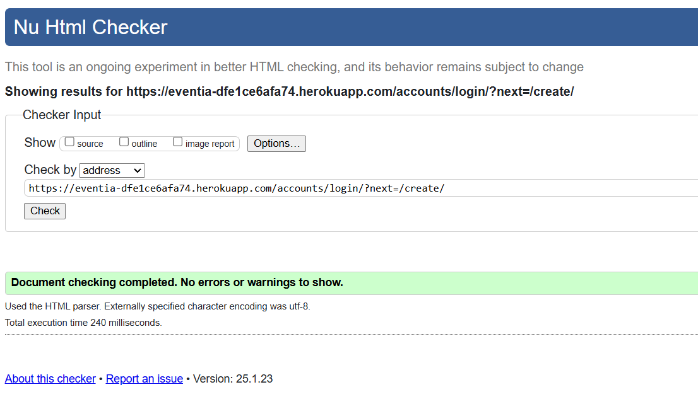
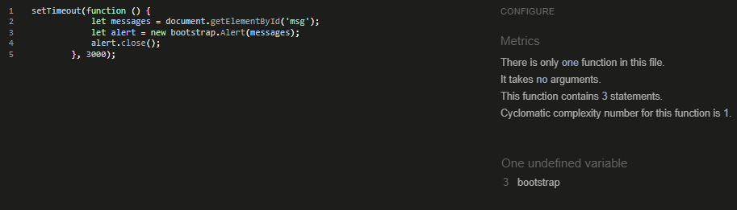
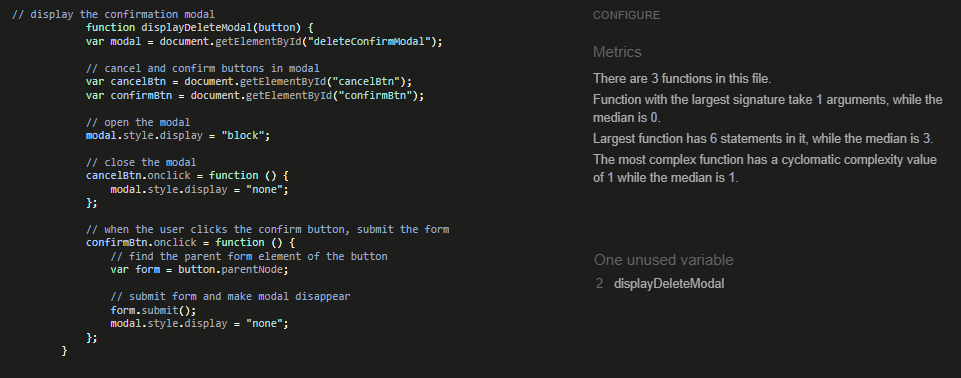
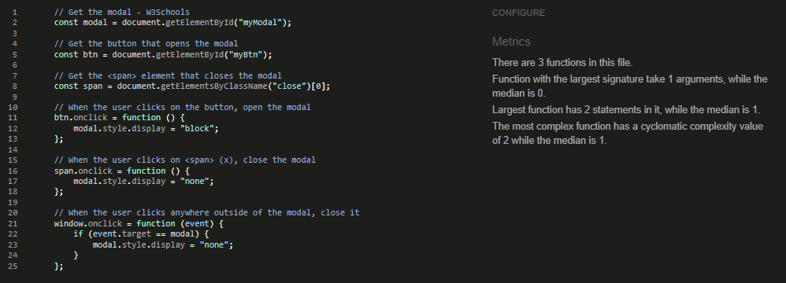
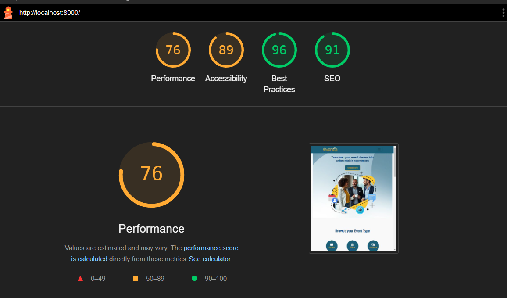
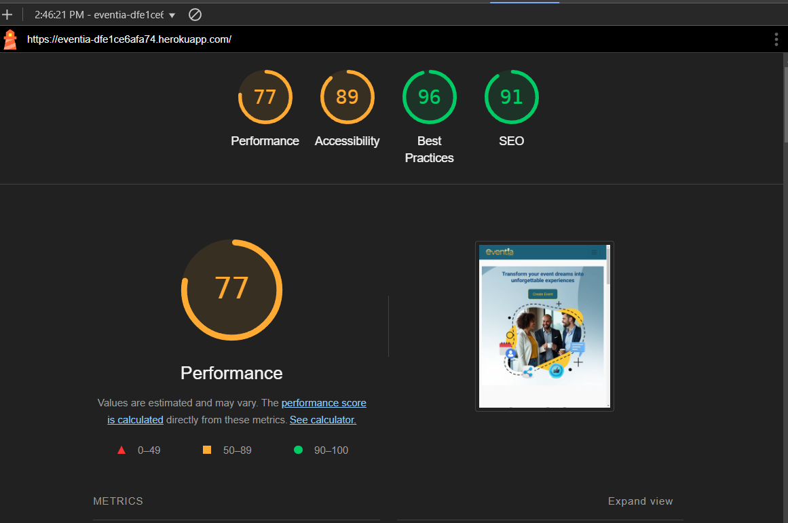

# Testing

This is the TESTING file for the [Eventia](https://eventia-dfe1ce6afa74.herokuapp.com/) website.

Return back to the [README.md](README.md) file.

## Testing Contents  
  
- [Testing](#testing)
  - [Testing Contents](#testing-contents)
  - [Validation](#validation)
    - [HTML Validation](#html-validation)
    - [JavaScript Validation](#javascript-validation)
    - [Python Validation](#python-validation)
    - [CSS Validation](#css-validation)
    - [Lighthouse Scores](#lighthouse-scores)
    - [Wave Accessibility Evaluation](#wave-accessibility-evaluation)
  - [Manual Testing](#manual-testing)
    - [User Input/Form Validation](#user-inputform-validation)
    - [Browser Compatibility](#browser-compatibility)
    - [Testing User Stories](#testing-user-stories)
    - [Dev Tools/Real World Device Testing](#dev-toolsreal-world-device-testing)
  - [Bugs](#bugs)
    - [Known Bugs](#known-bugs)

## Validation

### HTML Validation

For my HTML files I have used [HTML W3C Validator](https://validator.w3.org) to validate all of my HTML files.

I have had to follow a different approach for validating my HTML for this project as the majority of my pages are developed using Jinja syntax such as '' and '{{ form|crispy }}' and most require user authentication. The HTML validator will throw errors if I were to use my website's URL so I have had to follow the below approach for every page:

- Via the deployed Heroku app link, I have navigated to each individual page.
- Right clicking on the screen/CTRL+U/⌘+U on Mac, allows a menu to appear, giving me the option to 'View page source'.
- The complete HTML code for the deployed page will appear, allowing you to select the entire code using CTRL+A/⌘+A on Mac.
- Paste the copied code into the [validate by input](https://validator.w3.org/#validate_by_input) option.
- Check for errors and warnings, fix any issues, revalidate by following the above steps and record the results.

  

All HTML pages were validated and received a 'No errors or warning to show' result as shown above.

Initially, the Event Detail and User Profile pages encountered validator errors due to extra paragraph tags generated by the rich text editor. This issue was resolved by replacing the problematic tags with div elements. After redeployment and re-validation, no styling issues were observed.

| HTML Source Code/Page | Errors | Warnings |
| ---- | ------ | -------- | 
|Home|	0|	0|
|Login|	0|	0|
|Register|	0|	0|
|User Profile|	0|	0|
|Edit Profile Modal|	0|	0|
|Event Listing|	0|	0|
|Create Event|	0|	0|
|Event Detail|	0|	0|
|Edit Event|	0|	0|
|Delete Event|	0|	0|
|Delete Comment|	0|	0|
|RSVP|	0|	0|
|Cancel RSVP|	0|	0|
|User Notifications|	0|	0|
|Password Reset|	0|	0|
|Error| 403|	0|	0|
|Error| 404|	0|	0|

  

### JavaScript Validation

[JSHint](https://jshint.com/) was used to validate the small amount of JavaScript code added to the project. External JS, for Bootstrap purposes, obtained via [CDN](https://cdnjs.cloudflare.com/ajax/libs/bootstrap/5.2.3/js/bootstrap.min.js) was not validated through JSHint

| Page | Screenshot | Errors | Warnings |
| ---- | ---------- | ------ | -------- |
| base.html |  | none | none |
| gallery.html |  | none | none |
| profile.html |  | none | none |

[CI Python Linter](https://pep8ci.herokuapp.com/#) was used to validate the Python files that were created or edited by myself. No issues presented and line lengths were double checked. I have included some screenshots with the results below.

| Feature | admin.py | forms.py | models.py | urls.py | views.py |
|---------|----------|----------|-----------|---------|----------|

### Lighthouse Scores

Lighthouse testing was carried out in Incognito mode to acheive the best result. Performance was lower than preferred due to the site being image heavy. Images used in the sites design were saved in webp and png format, and compressed using [tinypng](https://tinypng.com/) and [Convertio](https://www.convertio.co) to offer the best chance for a decent performance score. The CDNs used for Bootstrap were also noted in the Lighthouse report as causing issue with performance. This report will be reviewed for future development of Freefido to raise this score.

**Desktop**  

  
*Desktop Home Page*  
  
  **Mobile**
  
*Mobile Home Page*

## Manual Testing

### User Input/Form Validation

Testing was carried out on desktop using a Chrome browser to ensure all forms take the intended input and process the input appropriately.

| Feature                    | Tested?  | User Input Required | User Feedback Provided     | Pass/Fail | Fix |
|----------------------------|----------|---------------------|----------------------------|-----------|-----|
|Navigation Bar|	Ye|s	Click	Links direct to correct pages, tooltips provide accessibility information|	Pass|
|Event Creation Form|	Yes|	Title, description, date, time, location, image/video|	Form validation ensures all required fields are filled, error messages for invalid input|	Pass|
|User Registration|	Yes|	Email, username, password|	Validation for email format, username/password uniqueness, password strength|	Pass|
|User Login|	Yes|	Username/email, password|	Error messages for invalid credentials|	Pass|
|Event Editing (Organizers)|	Yes|	Any event field|	Changes saved and reflected immediately	|Pass|
|RSVP Submission|	Yes|	Click|	Confirmation message after successful RSVP|	Pass|
|Comment Submission|	Yes|	Text input|	Comment awaiting moderation message	|Pass|
|Profile Update|	Yes|	Optional fields	Changes saved and reflected on profile page|	Pass|
|Event Sharing|	Yes|	Click|	Confirmation of successful sharing|	Pass|
|Event Search|	Yes|	Text input|	Results displayed or "No events found" message|	Pass|
|Delete Event (Organizers)|	Yes|	Confirmation click|	Event deleted or user returned to events page|	Pass|
Cancel RSVP|	Yes|	Confirmation click|	RSVP cancelled or user returned to event page|	Pass|

### Browser Compatibility

Eventia was tested on the following browsers, new users were created, old users data edited and all features were tested:

- Chrome v114.0.5735.199
- Firefox v114.0.2
- Edge v114.0.1823.79
- Safari v16.5.1

| Browser | Issue | Functionality |
|---------|-------|---------------|
| FireFox | Profile Edit/Upload Image - File input 'Browse' Button centered in input field | Button works as expected |
| FireFox | Profile Dashboard - scrollbars following Mozilla styling | No issue |
| Safari  | Scrollbars following Safari styling | No issue |

